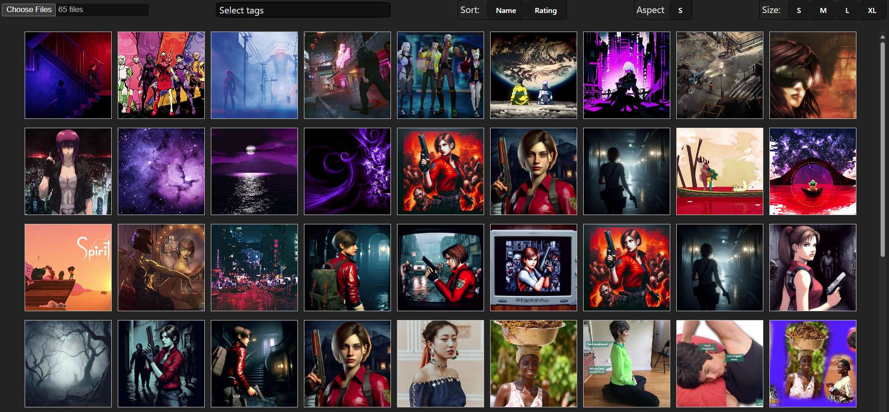

# Local Img Viewer

Live Link: https://sbingley22.github.io/local-img-viewer/

A local image viewer with various features for sorting and viewing image and movie files.
When in image overlay click top of screen to toggle image info. Click left or right to move to next / previous image.

----------------------

To do:

----------------------

npm run deploy (for gh-pages)
